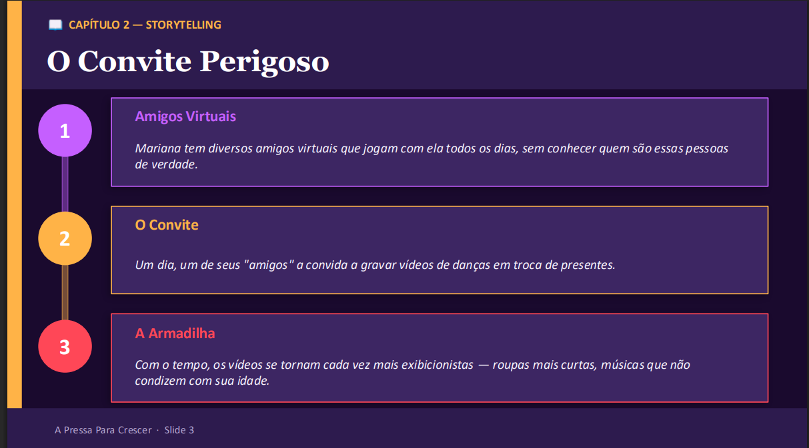

# Apresentação

Pré-requisitos: Todos os demais artefatos

> Conjunto de slides em um arquivo PowerPoint ou PDF
> com a apresentação do projeto contemplando todos os
> itens trabalhados nos demais artefatos. 
> **Links Úteis**:
> - [10 dicas de design para slides](https://rockcontent.com/blog/design-para-slides/)
> - [7 dicas de design para criar apresentações de PowerPoint incríveis e eficientes](https://www.shutterstock.com/pt/blog/7-dicas-de-design-para-criar-apresentacoes-de-powerpoint-incriveis-e-eficientes)
> - [Especialista do TED dá 10 dicas para criar slides eficazes e bonitos](https://soap.com.br/blog/especialista-do-ted-da-10-dicas-para-criar-slides-eficazes-e-bonitos)
> - [A regra 10-20-30 para apresentações de sucesso](https://revistapegn.globo.com/Noticias/noticia/2014/07/regra-10-20-30-para-apresentacoes-de-sucesso.html)
> - [Top Tips for Effective Presentations](https://www.skillsyouneed.com/present/presentation-tips.html)
> - [How to make a great presentation](https://www.ted.com/playlists/574/how_to_make_a_great_presentation)

## Slides

## Vídeo

No caso de apresentação gravada, insira aqui o link do vídeo de apresentação.
